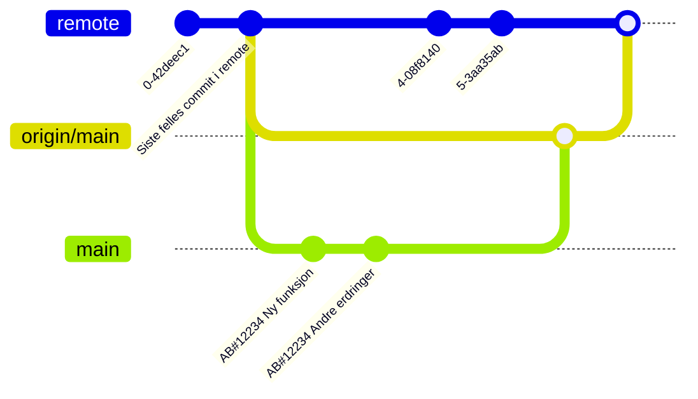
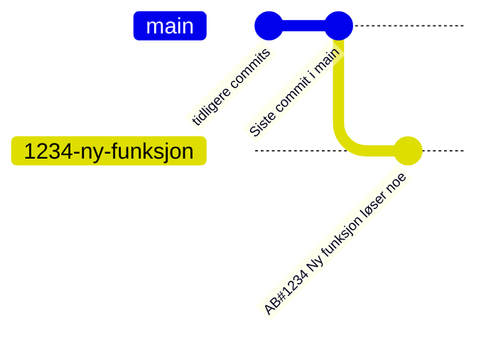
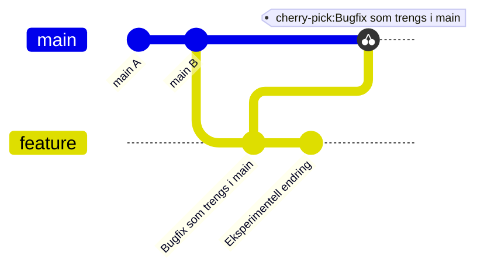
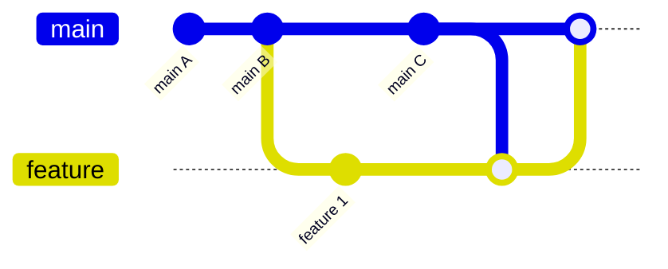
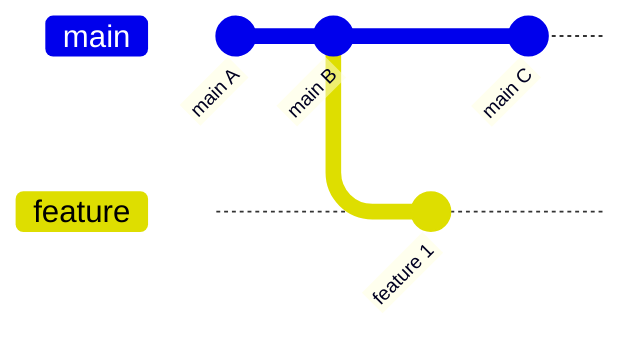
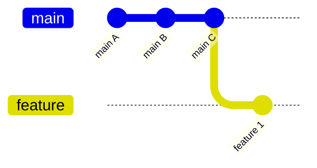

# Git-kurs: Praktisk bruk og bedre historikk

## 📚 Mål for kurset

* Praktisk og trygg daglig bruk av Git.
* Forstå hva som skjer bak hver kommando.
* Lage bedre commit-historikk som er ryddig og lett å spore.

Innholdsfortegnelse

- [0. Klone et repository](#0-klone-et-repository)
- [1. Git status – Sjekk hva som skjer](#1-git-status---sjekk-hva-som-skjer)
- [2. Synkronisere med remote: fetch og pull](#2-synkronisere-med-remote-fetch-og-pull)
- [3. `git checkout -b` – Opprett og bytt til ny branch](#3-git-checkout--b---opprett-og-bytt-til-ny-branch)
- [4. `git checkout` – Navigasjon og filhåndtering](#4-git-checkout---navigasjon-og-filhåndtering)
- [5. `git add -p` – Velg hva du faktisk vil commite](#5-git-add--p---velg-hva-du-faktisk-vil-commite)
- [6. Git diff – Se hva som endres](#6-git-diff---se-hva-som-endres)
- [7. Commit med gode meldinger](#7-commit-med-gode-meldinger)
- [8. Rydde i commits – `git rebase -i`](#8-rydde-i-commits---git-rebase--i)
- [9. `git cherry-pick` – Plukke spesifikke commits](#9-git-cherry-pick---plukke-spesifikke-commits)
- [10. Oppdatere branch fra main](#10-oppdatere-branch-fra-main)
- [11. Push til remote](#11-push-til-remote)
- [12. Merge pull requests til main](#12-merge-pull-requests-til-main)
- [13. Gitconfig og shortcuts](#13-gitconfig-og-shortcuts)
- [14. Deployment med Git](#14-deployment-med-git)

# TL;DR 📖 oppsummering

Følgende kommandoer bør du kunne

| Tema                          | Hovedregel                                   |
| ----------------------------- | -------------------------------------------- |
| `git status`                  | Sjekk hva som skjer hele tiden               |
| `git pull`                    | Hent endringer fra remote og merge inn       |
| `git checkout -b [branch]`    | Opprett og bytt til ny branch                |
| `git checkout [branch]`       | Bytt til eksisterende branch                 |
| `git add -p`                  | Velg endringer selektivt                     |
| `git diff`                    | Se endringer før commit                      |
| `git commit -m "[melding]"`   | Lag commit med god melding                   |
| `git rebase -i [commit]`      | Rydd opp i commits                           |
| `git rebase origin/main`      | Oppdater branch med endringer fra `main      |
| `git push -u origin HEAD`     | Push endringer til remote                    |
| `git cherry-pick [commit]`    | Plukk spesifikke commits fra andre branches  |
| `git reset --hard origin/main`| Deploy til produksjon, hard reset til remote |
| `git config --global alias.[alias] [kommando]` | Lag alias for vanlige kommandoer |

---

Kurset vil forsøke å følge typisk arbeidsflyt når du jobber


# 0. Klone et repository

Du kloner et eksisterende repository for å få en lokal kopi. Dette er ofte første steg i et prosjekt.

```bash
git clone [repository-url]
```

# 1. Git status – Sjekk hva som skjer

`git status` er en av de viktigste kommandoene i Git, og forteller deg:

* Hvilke filer som er endret.
* Hvilke filer som er staged for commit.
* Hvilke filer som ikke er tracked.
* Hvilken branch du er på.
* Forskjeller på din lokale branch og remote.

## 📅 Prinsipp

`git status`: Alltid, hele tiden!

# 2. Synkronisere med remote: fetch og pull

Remote er kopien av repositoriet sentralt på server, hos oss på github.com. Når du har klonet et repository, vil remote peke på det originale repositoriet i github. Du kan sjekke hva som er satt opp som remote til din lokale kopi, med:

```bash
git remote -v
```

For å hente de siste endringene fra remote, bruker du:

```bash
git fetch
```

Dette henter ned alle endringer som er gjort i remote-repositoriet, til en egen branch-folder som heter `origin`. Så `main` blir til `origin/main`, og `feature` blir til `origin/feature`, lokalt på din maskin.

For å få endringene inn i din lokale branch, bruker du:

```bash
git merge origin/main
```

Siden man ofte ønsker å gjøre begge deler, fetch og merge, finnes en snarvei, `git pull`, som fetcher først, og så merger dersom det er endringer i remote av den branchen du står i.

```bash
git pull
```
---


# 3. `git checkout -b` – Opprett og bytt til ny branch

Når du starter på en ny task, starter du typisk med å opprette en ny branch. Alle endringer må være i en branch, for senere å kunne merges inn i `main`.

Det kan være greit å ta med task-nummer som del av branch-navnet, slik at det er lett å se hvilken oppgave som er relatert til endringene. Vi ønsker å bruke task-nummeret til å kunne lenke tilbake til tasken i Azure DevOps, slik at vi kan se hva som ble gjort og hvorfor.


## 📅 Prinsipp

Bruk task-nummeret i branch-navnet:

[task-nummer]-[beskrivelse]

Eksempel:

```bash
    git checkout -b 1234-ny-funksjon
```

* __NB__: Branchen opprettes **lokalt på din maskin!!**
* __NB__: Hvis du ikke har en task, vurder å opprette en task i Azure DevOps

---

---

# 4. `git checkout` – Navigasjon og filhåndtering

Git checkout brukes ikke bare for å lage nye braches. Det er også en viktig kommando for å navigere mellom eksisterende branches, og for å hente spesifikke filer fra andre branches eller commits.

## 📅 Prinsipp

* `git checkout [branch-navn]`

  * Gå til en eksisterende branch.
  * __NB__ Dersom du har fetchet en ny branch fra remote, ligger denne som `origin/[branch-fra-remote]`. Tar du `git checkout [branch-fra-remote]`, vil den automagisk opprette en lokal branch med samme navn, med innholdet fra origin.

* `git checkout -`

  * Bytter til forrige branch du sto på. Praktisk snarvei.

* `git checkout [ref] -- [fil]`

  * Henter en spesifikk fil fra en annen branch eller commit. Filen blir lagt til staging-området, i branchen du står i.

Bruk `git checkout main -- config.yaml` for å hente `config.yaml` fra `main` inn i `feature`.

---

# 5. `git add -p` – Velg hva du faktisk vil commite

Hvis du har gjort endringer som fungerer, kan du legge dem til i staging-området med `git add`. Alle endringer må stages før de kan committes.

Når man jobber med utvikling blir det ofte gjort endringer som ikke skal være med i koden. Dette kan være linjer som kommenteres ut under testing, midlertidige `print`-setninger, eller andre endringer som ikke er klare for commit. For å unngå å ta med uønksede endringer, skal vi være selektive med hva vi legger til i commit.


## 📅 Prinsipp

* Bruk `git add -p` for endringer i eksisterende filer
* Bruk `git add [filnavn]` for nye filer

```bash
git add -p
```

### Hvorfor?

* Du kan velge hvilke endringer ("chunks") du vil ta med.
* Du unngår å committe midlertidig kode (f.eks. `print`, TODOs).
* Du kan splitte store endringer i små, logiske commits.

### 🚫 Unngå

```bash
git add .
git add -A
```

* For grovt, lett å legge til utilsiktede filer.

---

# 6. Git diff – Se hva som endres

I tillegg til `git status`, er det nyttig å se nøyaktig hva som har endret seg før du committer. Dette kan du gjøre med `git diff`. Denne gir deg en detaljert oversikt over endringene i filene dine, eller forskjeller mellom commits.

## 📅 Prinsipp

* Bruk `git diff` for å se endringer før commit.
* Bruk `git diff --cached` for å se hva som er staged for commit.
* bruk `git diff main` for å se forskjeller mellom din branch og `main`.
* Bruk `git diff [commit-hash]` for å se forskjeller fra der du er, og en spesifikk commit.
* Bruk `git diff [branch-name] [other-branch]` for å se forskjeller mellom to branches.

# 7. Commit med gode meldinger

Når du har staget endringene dine, er det på tide å committe dem. En god commit-melding er viktig for å forstå hva som ble gjort og hvorfor.

## 📅 Prinsipp

* Commit-meldinger på engelsk.
* Inkluder task-nummeret i commit-meldingen med `AB#[task-nummer]`.
* Overskrift: Kort oppsummering av hvorfor og hva som ble gjort.
* Bruk imperativ form (f.eks. "Legg til", "Fiks", "Oppdater").
* Hold overskriften kort og presis, gjerne under 50 tegn.
* Bruk en tom linje etter overskriften for bedre lesbarhet.
* Hvis nødvendig, bruk en lengre beskrivelse etter overskriften.

Eksempel commit-melding:

```
    AB#1234 Validate user input: avoid errors, improve UX

    * Process user input field by field
    * Validate input format
    * Add error handling for invalid input
```

# 8. Rydde i commits – `git rebase -i`

I mange tilfeller vil det være ønskelig å rydde opp i commit-historikken før du merger inn i `main`. Dette kan inkludere å slå sammen flere commits til én, endre commit-meldinger, eller fjerne unødvendige commits.

## 📅 Prinsipp

Bruk `git rebase -i` for å:

* Slå sammen commits (squash)
* Endre commit-meldinger
* Slette commits

```bash
git rebase -i [commit-hash]
```
---

# 9. `git cherry-pick` – Plukke spesifikke commits

## 📅 Prinsipp

`git cherry-pick` lar deg hente **enkelte commits** fra en annen branch inn i din egen.

```bash
git cherry-pick [commit-hash]
```

### Typiske bruksområder:

* Bugfix gjort i en annen branch som trengs i `main`.
* Gode endringer i eksperimentelle brancher.
* Raskt hente spesifikke commits uten å merge hele brancher.

---

## 🎒 Eksempel



Med `git cherry-pick` henter vi kun bugfix-commiten uten resten av feature-branchen.


# 10. Oppdatere branch fra main

Før du merger inn i `main`, kan det være du må oppdatere branchen din med de siste endringene fra `main`. Du gjør dette for å se om den nye koden din fremdeles fungerer selv om det er gjort andre endringer i `main`. Og det kan være at det ikke er mulig å merge koden din inn i main, fordi andre har endret samme fil som deg (Kan gi `merge`-konflikt).

Du oppdaterer koden din med de nye endringene fra main, med enten `rebase` eller `merge`.

## 📅 Prinsipp

### Rebase (anbefalt for ren historikk)

Rebase flytter dine commits til toppen av `main`, slik at historikken blir lineær og ryddig. Dette gjør det lettere å forstå hva som er gjort. En ulempe er at commit-historikken ikke lenger er korrekt, så du kan få rare feil-situasjoner hvis du f.eks. forsøker bruke `git bisect` for å finne feil. Men vakkert blir det!

```bash
git fetch origin
git rebase origin/main
```

### Merge (beholder ekte tidslinje)

Merge bevarer den ekte tidslinjen og historikken, slik at du kan se nøyaktig når endringene ble gjort. Dette er nyttig for å forstå konteksten rundt endringene. Det gjør at historikken blir mer kompleks, og ikke lijær og pen, som med rebase.

```bash
git fetch origin
git merge origin/main
```

---

## 🎒 Eksempel

### Merge commit



### Rebase

__før rebase__

__etter rebase__


Bruker `git rebase origin/main` for å flytte feature-commits oppå `main C`, før vi merger inn i `main`. Dette gir en renere historikk.
---

# 11. Push til remote

Når du er ferdig med endringene dine og har committet dem, er det på tide å sende dem til remote-repositoriet. Dette gjør at andre kan se og bruke endringene dine.

For å pushe, må git vite hvilken branch du vil pushe til. Hvis du har opprettet en ny branch, må du spesifisere den første gangen du pusher. Det enkleste er å bruke følgende kommando:

```bash
git push -u origin HEAD # angir at HEAD (der du står, i den branchen du er i) skal pushes til samme branch på origin
```

Kommandoen ovenfor kan du bruke hver gang du skal pushe, uavhengig av om branchen er ny eller eksisterende. Hvis du har opprettet en ny branch, vil den bli opprettet på remote også. Jeg har alltid en `git config`-alias for denne kommandoen, slik at jeg kan bruke `git p` i stedet for å skrive hele kommandoen.

Dersom du har pushet til remote, og så gjort endringer i historikken (f.eks. med `git rebase`), må du bruke `-f` for å tvinge push:

```bash
git push -f
```


# 12. Merge pull requests til main

Nå er vi ute av vår lokale git-verden, og inn i GitHub: Når du har pushet til github, vil det opprettes en branch du har pushet til. Går du inn på github, vil du få spørsmål om å opprette en pull-request (PR), som er en forespørsel om å merge endringene dine inn i `main`. Dette er en viktig del av arbeidsflyten, da det gir andre mulighet til å se over endringene dine før de merges. Når PR opprettes vil følgende skje:

* Tester kjøres automatisk (hvis satt opp).
* Codeowners får varsling om PR.
* Andre kan kommentere og gi tilbakemelding.

De fleste repostitories har en policy om at PR må godkjennes av minst én annen person før den kan merges inn i `main`. Dette sikrer at endringene er kvalitetssikret og at ingen ødelegger noe i `main`.

Merge til main er en tilsvarende operasjon som når du gjør merge eller rebase på main lokalt.

__NB__ Committ-historikk: Dersom du ikke har ryddet i commits i din branch, "kan" du rydde ved å gjøre en `squash`-merge. Dette vil slå sammen alle commits i din branch til én commit i `main`, og gi en renere historikk. Gjør dette kun dersom du ikke klarer å rydde i commits lokalt, og det du skal merge har en klar og tydelig hensikt. Ikke slå sammen masse commits som ikke har noe med hverandre å gjøre, da blir historikken rotete.

* Merge-commit: Tryggeste: Bruk dette for å beholde historikken slik den er, f.eks. dersom du har mange commits som er klart of fint kommentert.
* Squash-merge: Bruk dette for å slå sammen flere __tydelig relaterte__ commits til en. Gi i såfall en god commit-melding som oppsummerer hva som ble gjort i alle commits, og referer til task-nummeret i meldingen med AB#[task-nummer].
* Rebase-merge: Brukes for å oppdatere `main` med endringer fra din branch, og gir en lineær historikk. Bruk gjerne dette om du har kun en eller noen få commits som alle har gode commit-meldinger, og du ønsker å beholde dem som separate commits i `main`.

# 13. Gitconfig og shortcuts

For å gjøre hverdagen enklere, kan du sette opp aliaser for vanlige Git-kommandoer. Dette sparer tid og gjør arbeidsflyten mer effektiv.

## 📅 Prinsipp

* Lag kun aliaser du **faktisk bruker**, når du har lært deg hva de gjør.
* Det gir raskere og mer effektiv arbeidsflyt.

### Eksempler på aliaser:

```bash
git config --global alias.stat "status" # git status
git config --global alias.lg "log --oneline -10" # git log --oneline -10
git config --global alias.p "push -u origin HEAD" # git push -u origin HEAD
git config --global alias.pf "push -f -u origin HEAD" # git push -f -u origin HEAD
git config --global alias.amend "commit --amend --no-edit" # git commit --amend --no-edit
git config --global alias.cb "checkout -b" # git checkout -b
git config --global alias.co "checkout" # git checkout
git config --global alias.cp "cherry-pick" # git cherry-pick
git config --global alias.rebase "rebase -i" # git rebase -i
```

---

# 14. Deployment med Git

## 📅 Prinsipp

For deploy i produksjon eller server:

```bash
git fetch
git reset --hard origin/main
```

* Brukes for å sikre at arbeidsområdet matcher eksakt det som ligger i remote.
* Lokale, ikke-committede endringer forsvinner.

---

## ✅ Oppgave

1. Lag lokale endringer uten å committe.
2. Kør `git fetch` og deretter `git reset --hard origin/main`.
3. Observer at endringene er borte.

---


# 📖 Oppsummering

| Tema                      | Hovedregel                         |
| ------------------------- | ---------------------------------- |
| `git add -p`              | Velg endringer selektivt           |
| `git pull` vs `git fetch` | Fetch gir kontroll                 |
| `git checkout`            | Navigasjon og hente filer          |
| Git-aliaser               | Bruk snarveier du faktisk trenger  |
| `git rebase -i`           | Rydd opp og lag ren historikk      |
| Oppdatere branch          | Rebase for ren, merge for ærlig    |
| Deployment med git        | `reset --hard` gir eksakt remote   |
| `git cherry-pick`         | Plukk spesifikke commits selektivt |

---

Vil du lage en huskeliste, plakat eller presentasjon basert på dette? Jeg hjelper deg gjerne å tilpasse det til teamets behov! 😊
